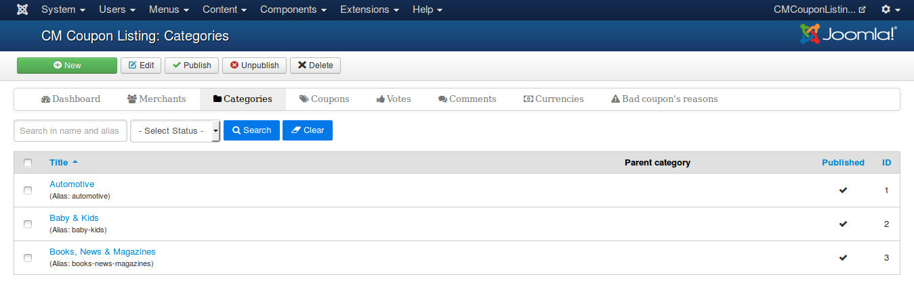
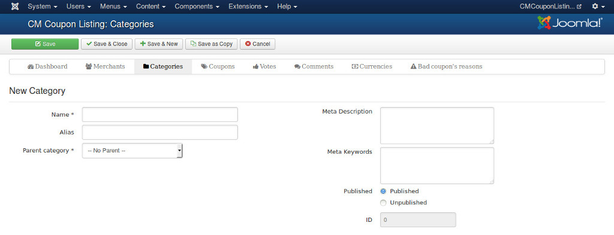
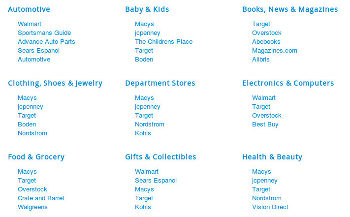

==========
Categories
==========

Create category
---------------

In your Joomla! back-end, you navigate to Components -> CMCouponListing -> Categories to access the list of categories.

On the toolbar, you click "New" button to create a new category.

In the form, there are the options:

* **Name**: Category's name.
* **Alias**: Category's alias for search engine friendly URL. An alias is created automatically if you don't provide any alias when you create or edit category.
* **Published**: Category is displayed in front-end if category is published.
* **ID**: Record number in database.

Category list
-------------

With "Categories" menu item, you can list all your parent categories and the merchants in these categories.

