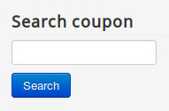
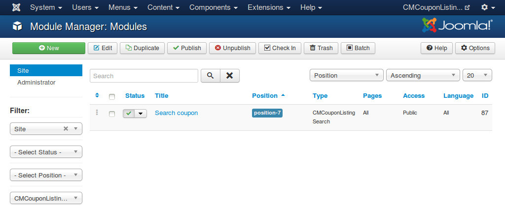

=============
Search module
=============

CMCouponListing Search module displays a text field where user can enter keywords and search for coupons or merchants.

You should use this module together with "Search" page. If you create a menu item for "Search" page, you can have a friendly URL for search result page.

After install the module via Extension Manager, you can find it in Module Manager. To find the module quickly, you can filter for "CMCouponListing Search" type.

The module doesn't have any special options.