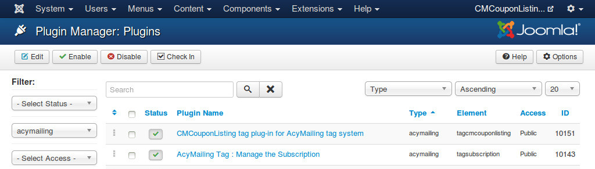
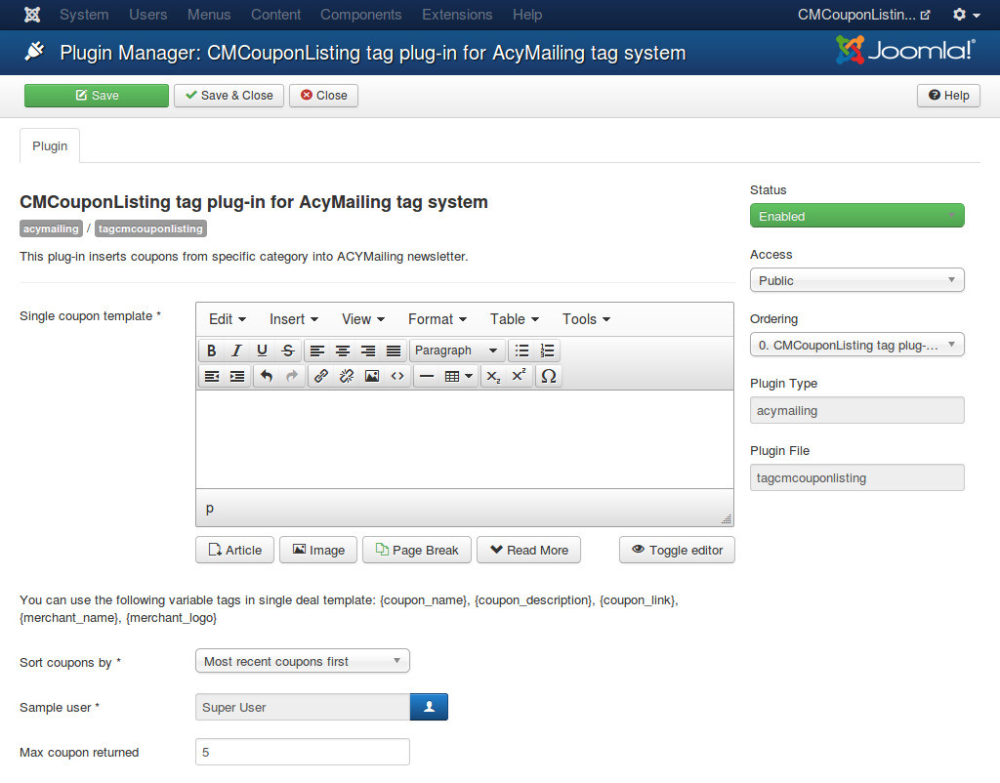

=========================
tagcmcouponlisting plugin
=========================

This plugin is only used if you want to integrate with ACYMailing component to send coupon newsletter to your subscribers.

tagcmcouponlisting plug-in helps you insert coupons in a specific category into ACYMailing's newsletter automatically.

After install the plugin, you can find it in your Plugin Manager.

You can find the following options in the plug-in setting:

* **Single coupon template**: Template of a coupon in ACYMailing newsletter. You can use HTML and CSS to design how a coupon looks like in newsletter. You can use the following variable tags, these tags will be replaced by real information of coupon:

  * {coupon_name}: Name of coupon.
  * {coupon_description}: Description of coupon.
  * {coupon_link}: Link to coupon's detail page.
  * {merchant_name}: Merchant's name.
  * {merchant_logo}: Image path to merchant's logo. You need to put this tag into a  HTML tag, otherwise image is not displayed. For example: .

* **Sort coupons by**: Coupons's ordering.
* **Sample user**: If you have special coupons which are only available to a specific access level group, you can select a user who are not in this access level group so that special coupons will not be insert in newsletter.
* **Max coupon returned**: Limit how many coupons are displayed at max.

In ACYMailing's newsletter, you can use this tag to insert a single coupon: {cmcouponlisting|category:X|ordering:Y}. "X" is the ID of the category you want to get coupons from, "Y" is the ordering number of coupon in the list of coupons returned from the plug-in.

For example, if your "Max coupon returned" is 5, and you want to get coupons from category ID 1, you can use the following tags:

{cmcouponlisting|category:1|ordering:1}

{cmcouponlisting|category:1|ordering:2}

{cmcouponlisting|category:1|ordering:3}

{cmcouponlisting|category:1|ordering:4}

{cmcouponlisting|category:1|ordering:5}

If there are only 4 coupons found in this category, the last tag is replaced by nothing, so your newsletter template is not broken.